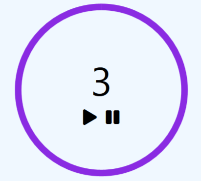

# timer

> :information_source: Latihan Class javascript

## About the Project
**Introduction**  
A simple countdown timer.

**Screenshoot** :rainbow:  

**Technologies**  
Javascript

**Launch**  
Demo - https://xvferdy.github.io/timer/

**Acknowledgements**  
Font Awesome - [fontawesome.com](https://fonts.google.com/)
